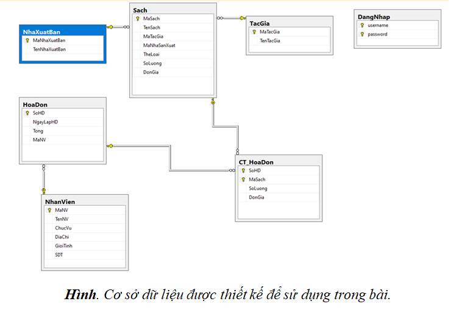

# [BCBT-CNN] | XÂY DỰNG CHƯƠNG TRÌNH QUẢN LÝ NHÀ SÁCH

# Tổng quan :

Đây là bài báo cáo bài tập tiểu luận của cá nhân thành viên thực hiện (phần thực hiện trong nhóm) đối với môn học “Công nghệ .NET”.

Nội dung sẽ bao gồm :

- Các chức năng của chương trình.
- Phạm vi báo cáo.
- Mục tiêu và mục đích của đề tài.
- Sự cần thiết và lí do chọn đề tài.

# Thiết kế cơ sở dữ liệu :

# Chức năng của chương trình :

Khách hàng chọn hàng hóa và nhân viên thực hiện tính toán. (nhân viên đăng nhập form Thu ngân).

- Tạo hóa đơn
- Thêm sản phẩm vào hóa đơn.
- Tính tổng
- Lưu dữ liệu vào HoaDon và CT_HoaDon

Người quản trị (administrator) có thể thực hiện những chức năng như :

- Các chức năng thêm, xóa và sửa với Sách (mã sách, tên sách, ...)
- Dữ liệu lưu vào bảng Sach.
- Thống kê hóa đơn (theo ngày).
- Quản lý nhân viên và thiết bị.

# Một số hình ảnh về chương trình :

# Phạm vi báo cáo :

- Chương trình viết trên ngôn ngữ C#, Windows Form và sử dụng hệ cơ sở dữ liệu MySQL.
- Hoạt động trên nền tảng Windows.
- Hệ cơ sở dữ liệu xác thực dạng Local.
- Chức năng chương trình bao gồm:
    - Thực hiện đăng nhập.
    - Các chức năng thêm, xóa và sửa đối với quản lý sách.
    - Các chức năng với hóa đơn (thêm, xóa và sửa món hàng).

# Mục tiêu và mục đích của đề tài :

## Mục tiêu :

- Sử dụng kiến thức đã học (C#, Windows Form, MySQL) để xây dựng chương trình.
- Xây dựng được các chức năng cơ bản cho chương trình.
- Phân chia thành phần ct cho các thành viên.

## Mục đích :

- Hoàn thành yêu cầu của môn học.
- Thực hành những kiến thức đã học (C#, MySQL và Windows Form.
- Rèn luyện những kĩ năng khác.

# Sự cần thiết của đề tài :

- Bối cảnh công nghệ “số” phát triển nhanh và chóng mặt.
- Phần mềm giải quyết được các vấn đề trong cuộc sống.
- Nâng cao hiệu suất làm việc.
- Giúp quản lý, theo dõi tiến độ công việc.

# Lí do chọn đề tài :

- Hiểu được đề tài → Ít nhất cũng biết được công việc cần làm đối với đề tài.
- Sở thích cá nhân → đề tài liên quan về sách, ít nhất một thành viên thể hiện sự quan tâm.
- Thời gian chọn đề tài → chọn chậm là làm đề tài khác.
- Muốn hoàn thành môn học.